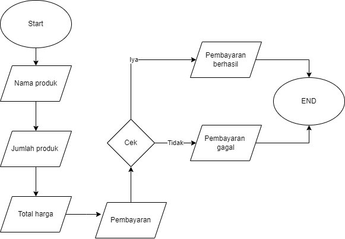

## SEBUAH PROGRAM UNTUK MENJUAL PRODUK WARUNG 

# STUDI KASUS
SEBUAH WARUNG MENJUAL BERBAGAI MACAM BARANG SEPERTI MIE INSTANS, ROTI AOKA, KOPI ABC, AQUA, TEH, TELOR, SAUS DENGAN HARGA YANG BERBEDA

# SOLUSI
MEBUAT SEBUAH MENU BARANG YANG DIJUAL DI WARUNG TERSEBUT AGAR PEMEBELI BISA MELIHAT BARANG YANG DIJUAL DAN HARGA BARANG YANG DIJUAL DI WARUNG TERSEBUT

#FLOWCHART
